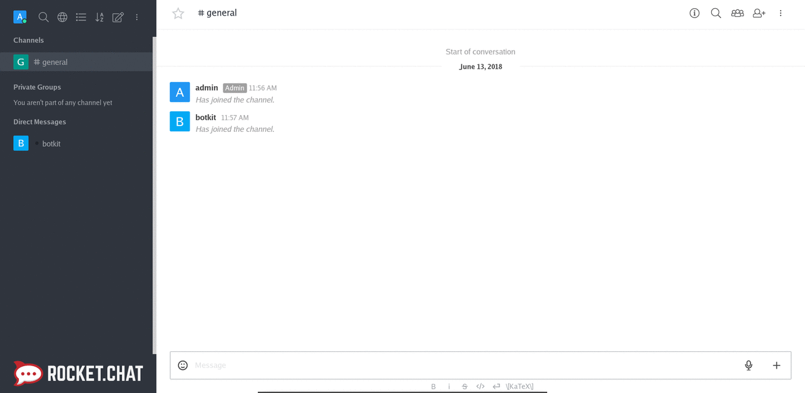

# Run a Botkit Bot

Botkit is the leading developer tool for building chat bots, apps and custom integrations for major
messaging platforms.

Botkit offers everything you need to design, build and operate an app:

* Easy-to-extend starter kits;
* Fully-featured SDK with support for all major platforms;
* [Tons of plugins and middlewares](https://botkit.ai/docs/readme-middlewares.html)

In addition, Botkit works with all the NLP services (like Microsoft LUIS and IBM Watson), it can use any
type of database, and runs on almost any hosting platform.

## Quick start guide

Botkit is a Node.js module and works with Node and npm.

The fastest way to start with Botkit is using [botkit-starter-rocketchat](https://github.com/RocketChat/botkit-starter-rocketchat):

**1. clone the starter repo and install dependencies**

```
git clone https://github.com/RocketChat/botkit-starter-rocketchat
cd botkit-starter-rocketchat/
npm install
```

**2. create a `.env` file with the following content**

```
ROCKETCHAT_URL=<ROCKETCHAT HOST>
ROCKETCHAT_USER=<BOTKIT USER NAME>
ROCKETCHAT_PASSWORD=<BOTKIT USER PASS>
ROCKETCHAT_USE_SSL=<SSL USAGE>
ROCKETCHAT_ROOM=<ROCKETCHAT CHANNEL>
MENTION_ROOMS=<CHANNEL THAT THE BOT WILL ONLY ANSWER WHEN MENTIONED>
RESPOND_TO_DM=<ENABLE BOT TO RESPOND TO DIRECT MESSAGES>
RESPOND_TO_LIVECHAT=<ENABLE BOT TO RESPOND TO LIVE CHAT>
RESPOND_TO_EDITED=<ENABLE BOT TO RESPOND TO EDITED MESSAGES>
```

**3. run the bot**

```
npm start
```

After executing the command, botkit will try to connect to the Rocket.Chat instance and then
will listen to messages in `general` room:

```
Initializing Botkit v0.6.16
info: ** No persistent storage method specified! Data may be lost when process shuts down.
debug: Setting up a handler for spawned
debug: Setting up a handler for heard_trigger
debug: Setting up a handler for command_triggered
debug: Setting up a handler for remote_command_end
debug: Setting up a handler for direct_message
debug: Setting up a handler for live_chat
debug: Setting up a handler for channel
debug: Setting up a handler for private_channel
[connect] Connecting { username: 'mybotuser',
password: 'mypassword',
ldap: false,
host: 'myserver.com',
useSsl: true,
timeout: 20000,
rooms: [ 'GENERAL' ],
allPublic: false,
dm: true,
livechat: true,
edited: true,
integrationId: 'js.SDK',
roomCacheMaxSize: 10,
roomCacheMaxAge: 300000,
dmCacheMaxSize: 10,
dmCacheMaxAge: 100000 }
debug: Setting up a handler for message_received
debug: Setting up a handler for sticker_received
debug: Setting up a handler for image_received
debug: Setting up a handler for audio_received
debug: Setting up a handler for heard_trigger
debug: Setting up a handler for conversationStarted
debug: Setting up a handler for message_received
~~~~~~~~~~
NOTE: Botkit Studio functionality has not been enabled
To enable, pass in a studio_token parameter with a token from https://studio.botkit.ai/
Botkit Studio statistics are no longer supported. Update your project to the latest version of Botkit, or add `stats_optout: true` to your bot configuration.
[connect] Connected
[login] Logging in mybotuser
[getRoomIdByNameOrId] Calling (caching): GENERAL
[getRoomIdByNameOrId] Success: "GENERAL"
[joinRoom] Calling (async): ["GENERAL"]
[joinRoom] Success
[subscribe] Preparing subscription: stream-room-messages: __my_messages__
[subscribe] Stream ready: 4
[reactive] Listening for change events in collection stream-room-messages
```

**4. talk to your bot**

On the server, login as a regular user (not the BOT user), go to `general` room, and try to talk to your bot:


